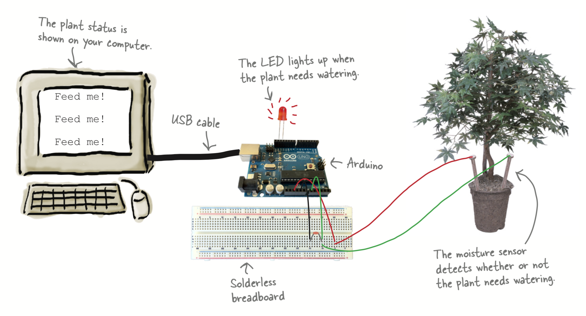
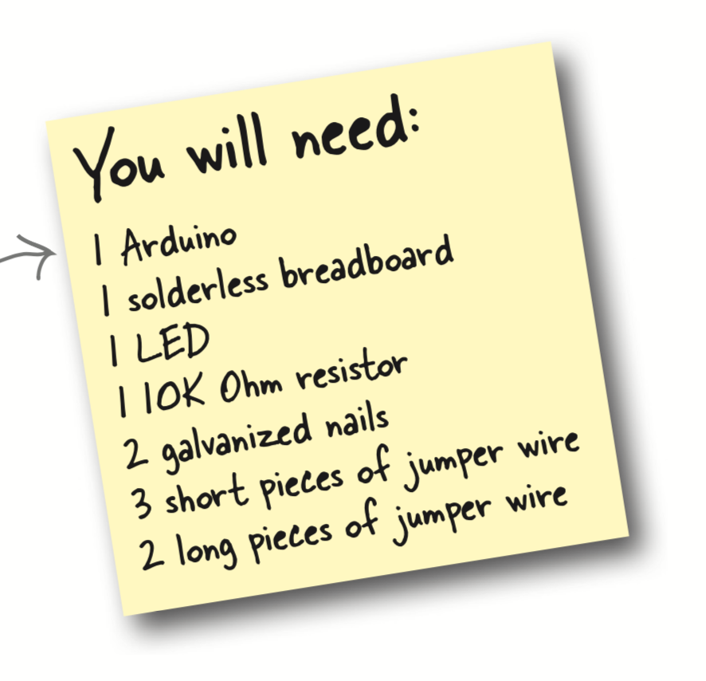
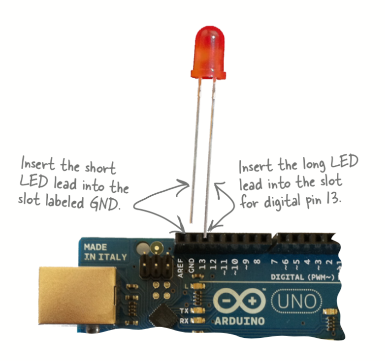
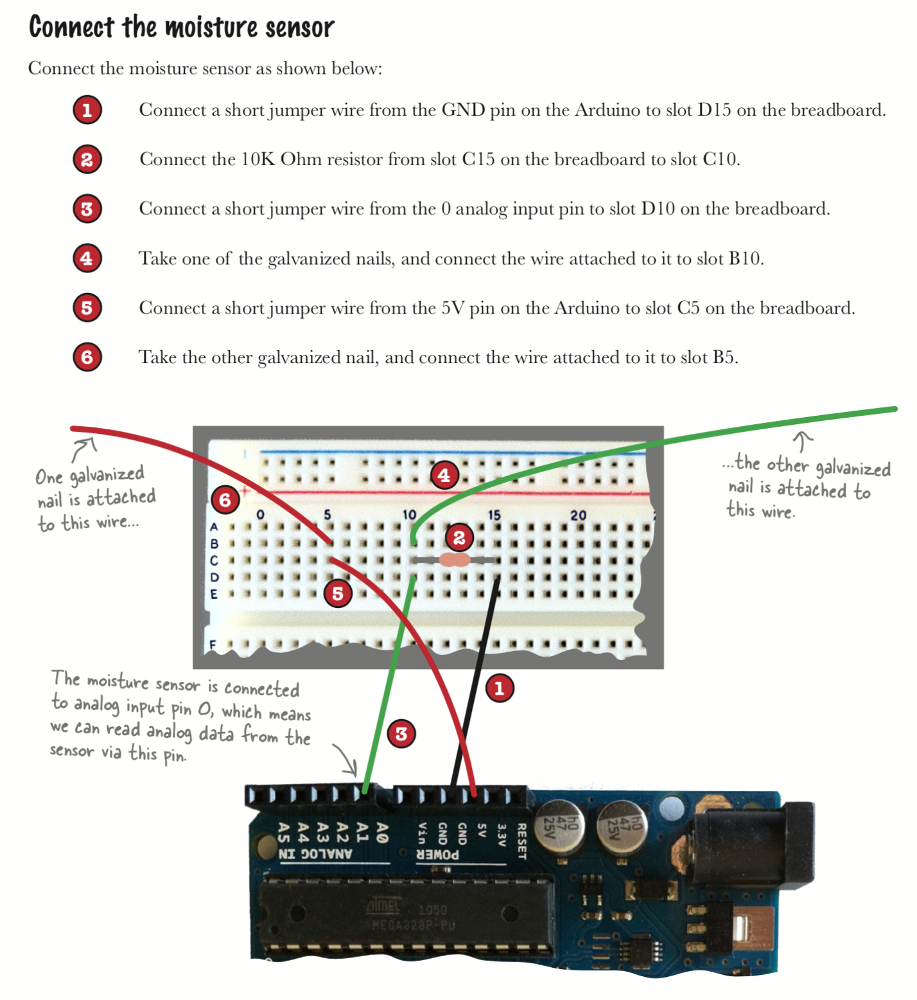
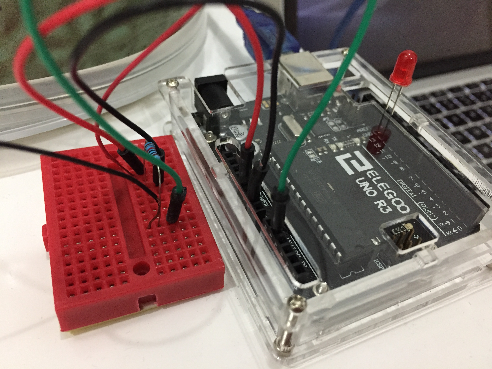
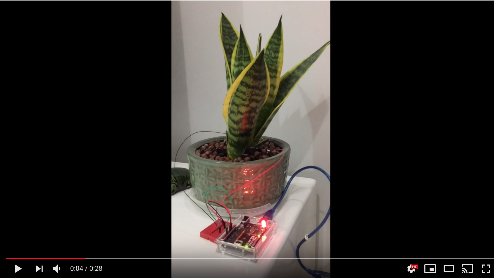

# Feed Me

Author: **Huy Dang**

Ever wished your plants could tell you when they need watering? Well, with an Arduino they can! In this lab, you’ll create an Arduino-powered plant monitor, all coded in C. Here’s what you’re going to build.

The plant monitor has a moisture sensor that measures how wet your plant’s soil is. If the plant needs watering, an LED lights up until the plant’s been watered, and the string “Feed me!” is repeatedly sent to your computer.
When the plant has been watered, the LED switches off and the string “Thank you, Seymour!” is sent once to your computer.

This is a C-lab challenge from "Head First C" book.

### Component Required


### Schematic

### Wiring Diagram

## Video Walkthrough

## Notes

Describe any challenges encountered while working on project.

## License

    Copyright [2018] [Huy Dang]

    Licensed under the Apache License, Version 2.0 (the "License");
    you may not use this file except in compliance with the License.
    You may obtain a copy of the License at

        http://www.apache.org/licenses/LICENSE-2.0

    Unless required by applicable law or agreed to in writing, software
    distributed under the License is distributed on an "AS IS" BASIS,
    WITHOUT WARRANTIES OR CONDITIONS OF ANY KIND, either express or implied.
    See the License for the specific language governing permissions and
    limitations under the License.